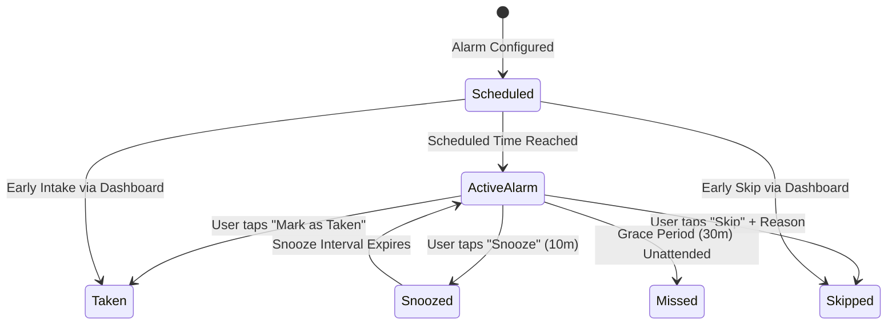
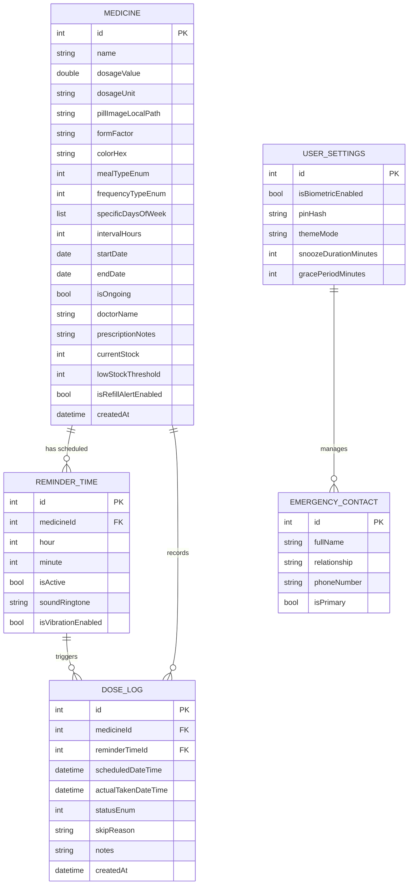

# MEDIALERT | PRODUCT REQUIREMENTS DOCUMENT & TECHNICAL SPECIFICATION (PRD)

**Project Name:** MediAlert (Pill Reminder & Medication Management App)  
**Document Version:** 2.0 (Offline-First Architecture & Design Language Overhaul)  
**Date:** August 2026  
**Document Status:** Approved / Ready for Engineering  
**Platform Target:** Android & iOS (Cross-Platform Flutter)  
**Primary Architecture:** Clean MVVM (Provider + BaseViewModel) with GetIt Service Locator  
**Data Storage Model:** 100% Local Device Database (Isar / Local Storage) — Offline-First  
**Design System:** Clinical Humanist (Corporate Modern + Humanist Warmth)  

---

## 1. Executive Summary & Vision

### 1.1 Product Overview
**MediAlert** is a high-reliability, offline-first mobile application designed to empower patients, elderly users, and caregivers to manage complex medication regimens with confidence. MediAlert solves the pervasive problem of medication non-adherence by providing precise audio/visual alarm reminders, visual pill photo verification, explicit meal-relation guidance (e.g., "Take after food"), inventory tracking, and comprehensive adherence analytics.

### 1.2 The Offline-First Mandate
Unlike conventional health applications that rely on mandatory cloud synchronization, user logins, and remote backends, MediAlert operates **strictly offline-first**:
- **Zero Remote Dependencies:** All medicine schedules, intake logs, photos, and emergency contacts are stored locally on the user's physical device.
- **Instantaneous Reliability:** Reminders and alarms execute natively through hardware-level exact alarm schedulers, immune to network dropouts or server downtime.
- **Absolute Patient Privacy:** Medical data never leaves the device without the user's explicit consent via local JSON/PDF export.

### 1.3 Core Product Objectives
1. **Zero-Failure Reminder Engine:** Deliver actionable, persistent audio/visual alarms with visual pill identification at scheduled times.
2. **Visual Intake Guidance:** Display actual medication photos and clear intake instructions (with meals, empty stomach, etc.) directly on the active alarm screen to prevent dosage errors.
3. **Frictionless Intake Logging:** Enable 1-tap intake confirmation ("Take", "Skip with reason", "Snooze") directly from the dashboard and alarm screens.
4. **Actionable Adherence Analytics:** Generate accurate mathematical adherence reports, streak metrics, visual charts, and printable medical PDF reports for clinical visits.
5. **Data Sovereignty:** Enable full local JSON backup and restore, plus biometric/PIN app lock security.

### 1.4 Non-Goals for Version 1.0 (MVP)
- **No Cloud User Accounts / Authentication:** No remote server authentication, OAuth, or cloud database sync.
- **No Direct Electronic Health Record (EHR) Integrations:** No direct HL7/FHIR API connections to hospital systems.
- **No Multi-Device Real-Time Sync:** No cross-device cloud websockets or distributed databases.
- **No Integrated E-Commerce Pharmacy:** No automated prescription refill ordering or payment gateway integrations.

---

## 2. Target User Personas & Medical Use Cases

| Persona | Demographics & Context | Core Pain Points | MediAlert Solution |
| :--- | :--- | :--- | :--- |
| **Forgetful & Busy Individuals** | Working professionals (25–50) taking daily vitamins or temporary prescriptions | Forgetting morning doses; getting distracted by meetings; confusing similar pills | Persistent high-priority alarms, 10-minute quick snooze, and clear pill photo identification. |
| **Elderly Users & Low-Vision** | Seniors (65+) managing daily maintenance medications (hypertension, diabetes) | Small fonts; confusing multi-step interfaces; missing alarms when phone is idle | High-contrast UI (Inter font, large text), Clinical Humanist color tokens, 48x48px min touch targets, full-screen alarm override. |
| **Chronic Care Patients** | Individuals with multi-drug regimens (Polypharmacy: 5+ pills daily) | Complex intake timing (before meal, after meal, bedtime); drug confusion; tracking adherence | Categorized time slots (Morning, Afternoon, Evening, Night), meal relation tags, inventory refill alerts, adherence history. |
| **Short-Term Prescription Patients** | Patients prescribed a 7–14 day antibiotic or post-surgery course | Stopping antibiotics prematurely; forgetting mid-day doses | Fixed duration scheduling (Start Date to End Date) with automatic completion celebration and course history log. |
| **Caregivers & Guardians** | Family members caring for aging parents or children | Uncertainty if patient took medicine; need verifiable logs for doctor consultations | Clean chronological intake history logs, adherence percentage calculations, and one-tap printable medical PDF exports. |

---

## 3. Medical Domain Rules & Adherence Logic

### 3.1 Medication Intake Statuses



| Status | Definition | Trigger Mechanism | Adherence Calculation Impact |
| :--- | :--- | :--- | :--- |
| **Scheduled / Pending** | Dose is upcoming for today and has not yet triggered. | Initial state created by scheduler. | Neutral (not counted in final adherence until time passes). |
| **Taken** | User confirmed taking the exact dose. | User taps "Mark as Taken" on Alarm or Dashboard. | **Increments** Adherence Rate. |
| **Skipped** | User intentionally chose not to take the dose (e.g., doctor advised, fasting, nausea). | User taps "Skip" and selects an optional reason. | **Excluded** from adherence denominator (does not penalize patient). |
| **Missed** | Alarm was dismissed without intake or left unattended past the 30-minute grace window. | System auto-logs after 30-minute timeout. | **Decreases** Adherence Rate. |
| **Snoozed** | User deferred reminder for a temporary interval. | User taps "Snooze" (default 10 min, configurable). | Temporarily reschedules trigger; remains pending. |

### 3.2 Mathematical Adherence Calculations
To ensure clinical accuracy for medical reports:

1. **Total Scheduled Doses:**
   $$\text{Total Scheduled} = \text{Taken} + \text{Skipped} + \text{Missed}$$

2. **True Adherence Rate (%):**
   $$\text{Adherence Rate (\%)} = \left( \frac{\text{Taken Doses}}{\text{Total Scheduled Doses} - \text{Skipped Doses}} \right) \times 100$$
   *(Note: Skipped doses with valid patient reasoning are excluded from the denominator to reflect true therapeutic compliance).*

3. **Missed Dose Percentage (%):**
   $$\text{Missed Percentage (\%)} = \left( \frac{\text{Missed Doses}}{\text{Total Scheduled Doses}} \right) \times 100$$

4. **Consecutive Streak Counter:**
   - Increments by $+1$ for every calendar day where $100\%$ of scheduled non-skipped doses are marked **Taken**.
   - Resets to $0$ if any scheduled dose becomes **Missed**.

---

## 4. Design Language System: Clinical Humanist

MediAlert employs the **Clinical Humanist** design system. It combines the rigorous clarity of medical-grade software with human warmth, soft visual aesthetics, and accessible ergonomics.

```
+-------------------------------------------------------------------------+
|                       CLINICAL HUMANIST DESIGN SYSTEM                   |
|                                                                         |
|  [ Calm Teal Primary ]    [ Success Green ]     [ Alert Red ]           |
|      #00685F                 #006E2F              #B61722               |
|                                                                         |
|  [ Typography ]    Inter (32sp / 24sp / 20sp / 16sp / 14sp / 12sp)      |
|  [ Elevation ]     L0: #F8FAFC  |  L1: #FFFFFF (Cards)  |  L2: Modals   |
|  [ Corner Radius ] Standard: 8px (sm/md)  |  Medication Cards: 24px (xl)|
|  [ Spacing Grid ]  4px Baseline Grid | 16px Gutter | 48x48px Touch Area |
+-------------------------------------------------------------------------+
```

### 4.1 Color Palette & Design Tokens

| Token Name | Hex Code | Semantic Role |
| :--- | :--- | :--- |
| **`primary`** | `#00685F` | Calm Medical Teal — Main app bars, active tabs, primary action buttons, brand anchors. |
| **`primary-container`** | `#008378` | Elevated teal containers and header cards. |
| **`on-primary`** | `#FFFFFF` | Text and icons displayed on top of primary colors. |
| **`secondary`** | `#006E2F` | Vitality Green — "Mark as Taken", 100% adherence indicators, positive streak badges. |
| **`secondary-container`** | `#6BFF8F` | Light success container for highlights and badge backgrounds. |
| **`tertiary / error`** | `#B61722` | Alert Coral/Red — "Missed Dose", emergency contacts, delete medication, low stock. |
| **`tertiary-container`** | `#FFDAD6` | Soft red container for missed dose cards and urgent alerts. |
| **`background`** | `#F8FAFC` | App canvas background (soft off-white to eliminate eye strain). |
| **`surface`** | `#FFFFFF` | Base card surface, dialog surface, bottom sheet background. |
| **`surface-container`** | `#ECEEF0` | Tiered neutral surface for chips, disabled states, and divider tracks. |
| **`textPrimary`** | `#191C1E` | High-contrast charcoal for titles, medication names, and vital data points. |
| **`textSecondary`** | `#3D4947` | Muted slate for dosages, time stamps, and secondary metadata. |
| **`outline`** | `#E2E8F0` | Subtle 1px structural borders on cards and text fields. |

### 4.2 Typography Hierarchy (Font: Google Fonts Inter)
All typography strictly integrates with `flutter_screenutil` (`.sp`) and adheres to WCAG AA contrast ratios ($\ge 4.5:1$):

| Style Name | Size / Weight | Line Height | Letter Spacing | Usage in UI |
| :--- | :--- | :--- | :--- | :--- |
| **`Display Large`** | `32.sp` / Bold (`700`) | `40.sp` | `-0.02em` | Daily Adherence Percentage, Alarm Clock Time. |
| **`Headline Medium`**| `24.sp` / SemiBold (`600`) | `32.sp` | `-0.01em` | Screen Titles (Dashboard, Reports, Add Med). |
| **`Headline Small`** | `20.sp` / SemiBold (`600`) | `28.sp` | `0.0em` | Medication Name on Timeline Card & Alarm. |
| **`Body Large`** | `18.sp` / Regular (`400`) | `28.sp` | `0.0em` | Intake instructions ("Take with a full glass of water"). |
| **`Body Medium`** | `16.sp` / Regular (`400`) | `24.sp` | `0.0em` | Form inputs, dialog body text, list descriptions. |
| **`Label Medium`** | `14.sp` / SemiBold (`600`) | `20.sp` | `+0.01em` | Time badges, Dosage labels ("500 mg - 1 Tablet"). |
| **`Label Small`** | `12.sp` / Medium (`500`) | `16.sp` | `+0.02em` | Category chips ("With Food", "Antibiotic", "Daily"). |

### 4.3 Shapes, Elevation & Spacing Principles
- **Border Radii:**
  - Standard Buttons & Text Fields: `8px` (`0.5rem` / `AppRadius.sm`)
  - Hero Medication Cards: `24px` (`1.5rem` / `AppRadius.xl`) for an inviting "holding" feel.
  - Status Indicators & Badges: Fully pill-shaped circular radii (`9999px`).
- **Elevation Layers:**
  - **Level 0 (Canvas):** `#F8FAFC` — Flat base.
  - **Level 1 (Cards):** `#FFFFFF` with ambient shadow `0px 4px 20px rgba(0, 0, 0, 0.04)`.
  - **Level 2 (Active Alarms & Dialogs):** `#FFFFFF` with pronounced shadow `0px 10px 30px rgba(0, 0, 0, 0.12)`.
- **Layout Grid & Touch Ergonomics:**
  - 4px baseline rhythm (`xs: 4px`, `sm: 8px`, `md: 16px`, `lg: 24px`, `xl: 32px`).
  - Strict minimum interactive touch target: **$48 \times 48\text{ px}$** for all buttons, checkboxes, and icons to assist tremors/elderly hands.

---

## 5. Software Architecture & Offline-First Engineering

### 5.1 Architectural Overview (Adapted from Mentor Guide)
The codebase follows **Clean MVVM (Model-View-ViewModel)** with dependency injection powered by **GetIt**. Source code is cleanly bifurcated into a `core` layer (pure logic, services, models) and a `ui` layer (screens, custom widgets, state providers).

```
lib/
├── main.dart                      # Bootstrap, Service locator init, Notification channels
├── app/
│   ├── app.dart                   # MaterialApp, ScreenUtilInit (375x812), Route generator
│   ├── locator.dart               # GetIt singleton registrations for all core services
│   ├── routes.dart                # Centralized Named Route definitions
│   └── theme.dart                 # ThemeData matching Clinical Humanist tokens
├── core/
│   ├── constants/                 # AppColors, AppTextStyles, AppSpacing, AppRadius, AppStrings
│   ├── enums/                     # ViewState, MedicineStatus, MealType, FrequencyType
│   ├── models/                    # Data entities (Medicine, ReminderTime, DoseLog, Contact)
│   ├── services/                  # DatabaseService (Isar), NotificationService, AlarmService,
│   │                              # LocalStorageService (SharedPreferences), PermissionService
│   └── view_model/                # BaseViewModel (safe setState, ViewState management)
└── ui/
    ├── custom_widgets/            # Reusable UI atoms (AppButton, PillCard, ProgressRing, etc.)
    └── screens/                   # Feature screens with co-located ViewModels:
        ├── splash/                # SplashScreen & SplashProvider
        ├── onboarding/            # OnboardingScreen & OnboardingProvider
        ├── dashboard/             # DashboardScreen & DashboardProvider
        ├── medicine/              # AddMedicineScreen & AddMedicineProvider
        ├── alarm/                 # ActiveAlarmScreen & AlarmProvider
        ├── history/               # HistoryScreen & HistoryProvider
        ├── reports/               # ReportsScreen & ReportsProvider
        ├── emergency/             # EmergencyScreen & EmergencyProvider
        └── settings/              # SettingsScreen & SettingsProvider
```

### 5.2 Mentor Guide Adaptation: Transitioning from Remote REST to 100% Local Database
In generic project guides, `DatabaseService` is frequently misnamed and wired to remote REST/Dio HTTP clients. **In MediAlert, this is formally replaced by a true local database engine:**

| Architectural Layer | Remote API Pattern (Generic Guide) | MediAlert Offline-First Implementation |
| :--- | :--- | :--- |
| **`DatabaseService`** | Wraps REST API / Dio endpoints | Wraps **Isar Database (NoSQL/Relational local SQLite engine)** for direct local queries. |
| **Data Latency** | 200ms – 2000ms network round-trip | $< 5\text{ms}$ instantaneous disk I/O. |
| **Availability** | Requires 4G/5G/WiFi connectivity | **100% offline uptime** (works in airplane mode, remote areas). |
| **Media Attachments** | S3 / Cloud Bucket URLs | Local file system sandboxed paths via `path_provider`. |
| **User Identifiers** | JWT / Bearer tokens in headers | Local device auto-incrementing integer IDs / UUIDs. |

### 5.3 State Management & ViewModel Lifecycle
Every screen uses a co-located `*_provider.dart` extending `BaseViewModel`:

```dart
// Core BaseViewModel Pattern
class BaseViewModel extends ChangeNotifier {
  ViewState _state = ViewState.idle;
  ViewState get state => _state;
  bool _isDisposed = false;

  void setState(ViewState viewState) {
    if (_isDisposed) return;
    _state = viewState;
    notifyListeners();
  }

  @override
  void dispose() {
    _isDisposed = true;
    super.dispose();
  }
}
```

- **Rule of Thumb:** Always invoke `setState(ViewState.busy)` before async operations and `setState(ViewState.idle)` upon completion.
- Screens bind via `ChangeNotifierProvider` and consume state via `Consumer<T>`.

### 5.4 Logging Conventions
Raw `print()` and `debugPrint()` are strictly forbidden in production business logic. All classes use `logger` with formatted class and method tags:
```dart
final log = CustomLogger(className: '@DashboardProvider');
log.i('@loadTodayTimeline: Loaded 6 doses for today');
log.e('@markAsTaken: Failed to update dose log', error, stackTrace);
```

---

## 6. Local Database Schema & Data Models (Isar)

All schemas are compiled with `isar_generator` for type-safe, ACID-compliant local transactions.



### 6.1 Entity Specification: `Medicine`
- `id` (Id): Auto-incrementing primary key.
- `name` (String): Commercial or generic drug name (e.g., "Amoxicillin").
- `dosageValue` (double): Numerical strength (e.g., `500.0`).
- `dosageUnit` (String): Unit of measure (`"mg"`, `"ml"`, `"Tablet"`, `"Capsule"`, `"Drops"`, `"Puff"`).
- `pillImageLocalPath` (String?): Sandboxed local file URI to the captured photo.
- `formFactor` (String): Physical shape identifier (`"tablet"`, `"capsule"`, `"syrup"`, `"injection"`, `"inhaler"`).
- `colorHex` (String): UI color accent for the medication card.
- `mealType` (Enum: `MealType`): `beforeMeal`, `afterMeal`, `withMeal`, `emptyStomach`, `noRelation`.
- `frequency` (Enum: `FrequencyType`): `daily`, `specificDays`, `interval`, `asNeeded`.
- `specificDaysOfWeek` (List<int>): Days active (1 = Monday ... 7 = Sunday).
- `intervalHours` (int?): E.g., every 8 hours.
- `startDate` (DateTime) & `endDate` (DateTime?): Course duration.
- `isOngoing` (bool): True for permanent maintenance therapy.
- `doctorName` (String?) & `prescriptionNotes` (String?): Special medical remarks.
- `currentStock` (int) & `lowStockThreshold` (int): Inventory counter.
- `isRefillAlertEnabled` (bool): Triggers alert when `currentStock <= lowStockThreshold`.

### 6.2 Entity Specification: `ReminderTime`
- `id` (Id): Primary key.
- `medicineId` (int): Foreign key link to parent `Medicine`.
- `hour` (int: `0..23`) & `minute` (int: `0..59`): Exact 24-hour time trigger.
- `isActive` (bool): Master toggle for the reminder slot.
- `soundRingtone` (String): Selected alarm tone asset path or system sound URI.
- `isVibrationEnabled` (bool): Haptic motor toggle.

### 6.3 Entity Specification: `DoseLog`
- `id` (Id): Primary key.
- `medicineId` (int): Foreign key link to `Medicine`.
- `reminderTimeId` (int?): Foreign key link to triggering reminder.
- `scheduledDateTime` (DateTime): Exact scheduled timestamp.
- `actualTakenDateTime` (DateTime?): Timestamp when user confirmed intake.
- `status` (Enum: `MedicineStatus`): `pending`, `taken`, `skipped`, `missed`, `snoozed`.
- `skipReason` (String?): Predefined choice (`"Nausea"`, `"Doctor Advised"`, `"Felt Fine"`, `"Ran Out"`, `"Other"`).
- `notes` (String?): Optional user observation.

### 6.4 Entity Specification: `EmergencyContact`
- `id` (Id): Primary key.
- `fullName` (String): Name of doctor, clinic, or caregiver.
- `relationship` (String): `"Primary Care Doctor"`, `"Cardiologist"`, `"Spouse"`, `"Son/Daughter"`.
- `phoneNumber` (String): Clean phone digits for direct telephony intents.
- `isPrimary` (bool): Highlighted emergency speed-dial recipient.

---

## 7. Core Service Layer Contracts

All services are registered as singletons in `lib/app/locator.dart`.

```dart
final locator = GetIt.instance;

void setupLocator() {
  locator.registerLazySingleton<DatabaseService>(() => DatabaseService());
  locator.registerLazySingleton<NotificationService>(() => NotificationService());
  locator.registerLazySingleton<AlarmService>(() => AlarmService());
  locator.registerLazySingleton<LocalStorageService>(() => LocalStorageService());
  locator.registerLazySingleton<PermissionService>(() => PermissionService());
}
```

### 7.1 `DatabaseService` (Local Isar Data Access Object)
- `Future<void> init()`: Opens Isar instance, handles schema migrations.
- `Future<List<Medicine>> getAllMedicines()`: Streams or fetches all active medications.
- `Future<int> saveMedicine(Medicine medicine, List<ReminderTime> reminders)`: Saves medication and schedules reminders atomically.
- `Future<void> deleteMedicine(int id)`: Cascades deletion to reminders and clears scheduled alarms.
- `Future<List<DoseLog>> getDoseLogsForDate(DateTime date)`: Returns all intake entries for a specific day.
- `Future<void> logDoseIntake(int doseLogId, MedicineStatus status, {String? reason})`: Updates intake log and decrements medication inventory if taken.
- `Future<AdherenceStats> getAdherenceStats(DateTime startDate, DateTime endDate)`: Computes adherence rate, taken count, missed count, and streak.
- `Future<String> exportDatabaseToJson()`: Serializes all collections to a JSON string.
- `Future<bool> importDatabaseFromJson(String jsonContent)`: Validates and restores database state.

### 7.2 `AlarmService` & `NotificationService`
- `Future<void> scheduleMedicationAlarm(Medicine medicine, ReminderTime reminder)`: Registers high-priority exact alarm via `flutter_local_notifications` and Android `AlarmManager`.
- `Future<void> cancelMedicationAlarm(int reminderId)`: Removes scheduled system trigger.
- `Future<void> triggerFullScreenAlarm(int medicineId, int reminderTimeId)`: Displays full-screen lockscreen-overriding alert with audio loop and vibration.
- `Future<void> snoozeAlarm(int doseLogId, int durationMinutes)`: Reschedules trigger after specified minutes.

### 7.3 `LocalStorageService` (`SharedPreferences` Wrapper)
- `bool get isFirstTimeUser` / `setFirstTimeUser(bool val)`
- `bool get isBiometricLockEnabled` / `setBiometricLockEnabled(bool val)`
- `String? get pinCodeHash` / `setPinCodeHash(String hash)`
- `ThemeMode get themeMode` / `setThemeMode(ThemeMode mode)`
- `int get defaultSnoozeMinutes` / `setDefaultSnoozeMinutes(int mins)`

### 7.4 `PermissionService`
- `Future<bool> requestNotificationPermission()`: Requests system notification rights.
- `Future<bool> requestExactAlarmPermission()`: Requests Android 12+ `SCHEDULE_EXACT_ALARM`.
- `Future<bool> requestCameraAndGalleryPermission()`: Requests camera and photo storage access for pill photos.
- `Future<bool> authenticateWithBiometrics()`: Evaluates Face ID / Fingerprint via `local_auth`.

---

## 8. Detailed Screen Specifications & User Flows

```
+-------------------------------------------------------------------------+
|                           APP NAVIGATION FLOW                           |
|                                                                         |
|  [ Splash Screen ] ---> [ Permission / Onboarding ]                     |
|           |                                                             |
|           v                                                             |
|  [ PIN / Biometric App Lock ] (If enabled)                              |
|           |                                                             |
|           v                                                             |
|  +-------------------------------------------------------------------+  |
|  | Main Shell (Bottom Navigation Bar)                                |  |
|  |  (1) Dashboard   (2) History/Calendar  (3) Reports  (4) Settings  |  |
|  +-------------------------------------------------------------------+  |
|        |                  |                                             |
|        +---> [ + FAB ] -> [ Add / Edit Medication Wizard ]              |
|        |                                                                |
|        +---> [ Alarm Event Triggered ] -> [ Full-Screen Alarm Modal ]   |
|        |                                                                |
|        +---> [ Emergency Icon ] -> [ Emergency Speed-Dial Sheet ]      |
+-------------------------------------------------------------------------+
```

### 8.1 Splash & App Startup Sequence
1. `WidgetsFlutterBinding.ensureInitialized()` executes.
2. `setupLocator()` registers singletons.
3. `LocalStorageService.init()` loads stored flags.
4. `DatabaseService.init()` opens Isar local storage.
5. `NotificationService.init()` configures notification channels and exact alarm permissions.
6. **Routing Decision:**
   - If `isFirstTimeUser == true` $\rightarrow$ Navigate to `OnboardingScreen`.
   - If `pinCodeHash != null` $\rightarrow$ Navigate to `AppLockScreen`.
   - Otherwise $\rightarrow$ Navigate to `DashboardScreen`.

### 8.2 Onboarding Flow (`OnboardingScreen`)
- **Slide 1:** "Never Miss a Dose" — Visual alarm reminders with exact timing.
- **Slide 2:** "Visual Pill Verification" — Attach pill photos and food instructions.
- **Slide 3:** "100% Offline & Private" — No accounts, no servers, full health privacy.
- **Action:** Permission grant step (Notifications + Alarms) $\rightarrow$ "Get Started" CTA.

### 8.3 Dashboard (`DashboardScreen`)
- **Header:** Personalized greeting, current date, and Emergency Speed-Dial icon.
- **Adherence Summary Card:** Circular SVG/Canvas progress ring showing today's score: `X of Y Doses Taken` (with motivational text, e.g., "Great job! You're on track today").
- **Week Strip / Horizontal Date Selector:** Tappable 7-day strip allowing navigation to past days or tomorrow.
- **Segmented Timeline View:** Doses grouped chronologically:
  - 🌅 **Morning** (05:00 – 11:59)
  - ☀️ **Afternoon** (12:00 – 16:59)
  - 🌆 **Evening** (17:00 – 21:59)
  - 🌙 **Night** (22:00 – 04:59)
- **Timeline Medication Card:**
  - Left: Circular pill photo or color-coded icon avatar.
  - Middle: Medicine Name (`HeadlineSmall`), Dosage (`500 mg - 1 Tablet`), Meal Chip (`After Meal`).
  - Right: Scheduled Time Badge + Status Indicator (Green Check for Taken, Red Exclamation for Missed).
  - Bottom Quick Actions: Full-width **[Mark as Taken]**, **[Snooze 10m]**, **[Skip]**.
- **Floating Action Button (FAB):** Prominent Center-docked primary teal `+` button to add new medication.
- **Empty State:** Illustrated soothing graphic with "No medications scheduled for today" and "Add Your First Medication" button.

### 8.4 Add / Edit Medication Workflow (`AddMedicineScreen`)
A structured 4-step wizard designed to eliminate cognitive fatigue:
- **Step 1: Medicine Identification**
  - Text input for Medicine Name (with instant duplicate name warning prompt).
  - Photo Attachment: Camera capture or Gallery picker; stored locally via `path_provider`.
  - Form factor icon selector (Tablet, Capsule, Liquid, Injection, Inhaler, Drops).
  - Color palette accent picker for UI identification.
- **Step 2: Dosage & Meal Relation**
  - Numerical Dosage input (e.g., `250`, `500`) + Unit selector dropdown (`mg`, `ml`, `pills`, `units`).
  - Meal relation chips: `[Before Meal]`, `[After Meal]`, `[With Food]`, `[Empty Stomach]`, `[No Relation]`.
- **Step 3: Schedule & Alarm Times**
  - Frequency selector: `Daily`, `Specific Days of Week` (M T W T F S S toggles), `Hourly Interval` (Every 4/6/8/12 hrs), or `As Needed (PRN)`.
  - Alarm Times: Add multiple time triggers per day (e.g., `08:00 AM`, `02:00 PM`, `08:00 PM`).
  - Course Duration: Toggle `Ongoing Maintenance` or set `Start Date` $\rightarrow$ `End Date`.
- **Step 4: Inventory & Extra Notes (Optional)**
  - Current Pill Stock count (e.g., 30) + Low Stock Alert Threshold (e.g., 5 pills left).
  - Doctor Name & Prescription Notes (e.g., "Prescribed by Dr. Smith for ear infection").
- **Validation Rules:**
  - Name and dosage cannot be empty or zero.
  - At least one alarm time must be configured for non-PRN schedules.
  - Saving persists to Isar and registers exact alarms immediately.

### 8.5 Full-Screen Active Alarm Screen (`ActiveAlarmScreen`)
Launched upon exact alarm trigger with continuous high-volume audio and vibration (overriding device lockscreen):
- **Hero Image:** High-resolution display of the user's custom pill photo.
- **Critical Labels:** High-contrast Medicine Name (`DisplayLarge`), Exact Dosage, and prominent Meal Guidance Badge (e.g., ⚠️ *"Take with a full meal"*).
- **Three High-Contrast Action Triggers:**
  - 🟢 **[ Mark as Taken ]** (Huge, prominent touch button) $\rightarrow$ Stops audio, logs `Taken`, decrements stock, closes screen.
  - 🟡 **[ Snooze (10 Mins) ]** $\rightarrow$ Schedules snooze timer, dismisses screen.
  - 🔴 **[ Skip Dose ]** $\rightarrow$ Opens modal sheet with reasons (`Felt fine`, `Side effects`, `Doctor advice`, `Ran out`), logs `Skipped`.
- **Auto-Timeout Safety Rule:** If unattended for 30 minutes, system stops audio and automatically marks dose as `Missed`.

### 8.6 Adherence History & Calendar View (`HistoryScreen`)
- **Interactive Calendar Heatmap:**
  - Color-coded day cells: 🟢 Green ($100\%$ adherence), 🟡 Yellow ($50\%-99\%$), 🔴 Red ($< 50\%$ or missed doses), ⚪ Grey (No scheduled doses).
  - Tapping a calendar date filters the dose log list below.
- **Dose History List:**
  - Filter chips: `[All]`, `[Taken]`, `[Skipped]`, `[Missed]`.
  - Log item shows time taken vs. time scheduled.
  - **Retroactive Correction:** Allows user to tap any past dose and manually update status (e.g., "I took this 30 mins ago").

### 8.7 Reports, Analytics & PDF Generation (`ReportsScreen`)
- **Metric Cards:**
  - Overall Monthly Adherence Percentage (`94%`).
  - Total Doses Taken vs. Missed vs. Skipped.
  - Current Consecutive Intake Streak (e.g., 🔥 `14 Days`).
- **Visual Adherence Charts (`fl_chart`):**
  - Donut Chart: Breakdown of intake statuses for the selected month.
  - Weekly Bar Chart: Day-by-day compliance comparison.
- **Printable Medical PDF Export:**
  - Generates a clinical-grade PDF summary using `pdf` & `printing` packages.
  - PDF includes: Patient Name, Reporting Period, Total Adherence %, Medication List with Dosages, Detailed Log Table, and Doctor Signature line.
  - Direct actions: **[Preview PDF]**, **[Print]**, **[Share / Save to Files]**.

### 8.8 Emergency Contacts (`EmergencyScreen`)
- Displays list of doctors, specialists, and family caregivers.
- 1-Tap Speed-Dial Button: Fires direct OS phone dialer (`tel:1234567890`) via `url_launcher`.
- 1-Tap SMS Alert: Fires SMS intent with pre-filled message ("Hello, I need assistance with my medication").

### 8.9 Settings, Security & Data Management (`SettingsScreen`)
- **App Security:**
  - Toggle 4-digit PIN lock.
  - Toggle Biometric authentication (Face ID / Fingerprint).
- **Alarm Preferences:**
  - Custom Alarm Ringtone selector.
  - Vibration pattern toggle.
  - Default Snooze duration slider (`5`, `10`, `15`, `30` mins).
  - Missed dose grace period slider (`15`, `30`, `60` mins).
- **Theme Selection:**
  - `Light Mode` (Clinical Humanist default), `Dark Mode`, `System Default`.
- **Local Data Backup & Recovery:**
  - **[Export Database Backup (JSON)]**: Writes complete database dump to device storage.
  - **[Restore Database from JSON]**: Validates JSON schema, restores collections, and reschedules all active alarms.
  - **[Clear All Data]**: Destructive reset with double confirmation modal.

---

## 9. Non-Functional Requirements & Engineering Standards

### 9.1 Performance & Reliability
- **Cold App Launch:** $< 1.5$ seconds to interactive dashboard.
- **Database Query Latency:** $< 15\text{ ms}$ for timeline queries on datasets with $10,000+$ dose logs.
- **Frame Rate:** Consistent 60 FPS scrolling on all lists and animations.
- **Memory Footprint:** $< 120\text{ MB}$ RAM during active execution.
- **Alarm Reliability:** $99.99\%$ execution rate using Android `SCHEDULE_EXACT_ALARM` with Foreground Service and iOS native local notifications.

### 9.2 Data Privacy & Compliance
- **Zero Telemetry / Tracking:** No third-party analytical trackers, crash SDKs transmitting PII, or remote logging.
- **Local File Sandboxing:** Pill images stored in application private directory (`getApplicationDocumentsDirectory()`), preventing indexing by generic photo galleries unless exported.

### 9.3 Accessibility (a11y) & Usability Standards
- **WCAG 2.1 AA Compliance:** Minimum color contrast ratio of $4.5:1$ for normal text and $3.0:1$ for large text and UI components.
- **Touch Target Size:** Minimum hit target of $48 \times 48\text{ dp}$ across all interactive widgets.
- **Screen Reader Support:** Semantic labels applied to all icon buttons and photo cards (`Semantics(label: "Take Amoxicillin 500mg")`).

---

## 10. Verification & Quality Assurance Plan

```
+-------------------------------------------------------------------------+
|                        AUTOMATED TESTING SUITE                          |
|                                                                         |
|  [ Unit Tests ]          -> Adherence formulas, Isar DAOs, ViewModels   |
|  [ Widget Tests ]        -> Timeline cards, Progress ring, Alarm dialog |
|  [ Integration Tests ]   -> Full Add Medicine -> Alarm Trigger flow    |
+-------------------------------------------------------------------------+
```

### 10.1 Automated Test Suites
1. **Adherence Formula Unit Tests:**
   - Verify calculation when skipped doses $> 0$.
   - Verify streak reset logic upon missed dose.
2. **Database DAO Unit Tests:**
   - Test CRUD operations for `Medicine`, `ReminderTime`, and `DoseLog`.
   - Test cascading deletion of reminders when a medicine is deleted.
   - Test JSON export and import data integrity.
3. **ViewModel State Unit Tests:**
   - Verify `DashboardProvider.loadTodayTimeline()` transitions from `ViewState.busy` to `ViewState.idle`.
   - Verify error state handling when storage is full.
4. **Widget Tests:**
   - Validate responsive sizing on small screens (320dp) and large tablets (600dp+).
   - Test that "Mark as Taken" updates card state without full screen redraw glitch.

### 10.2 Manual QA Checklist
- [ ] Test alarm firing when device is locked and screen is off.
- [ ] Test alarm firing when device is in "Do Not Disturb" (verifying high-priority alarm channel override).
- [ ] Test app kill/reboot scenario: Ensure alarms are rescheduled on `BOOT_COMPLETED`.
- [ ] Test pill image capture from camera and verify thumbnail displays correctly on active alarm screen.
- [ ] Test PDF export generation and verify layout on physical printout.
- [ ] Test PIN lock protection upon backgrounding and resuming app.

---

## 11. CI/CD Pipeline & Git Branching Strategy

```
dev (Active Development & Feature Branches)
 │
 ├──> PR & Code Review
 │
 ▼
test (Automated CI Builds, Unit & Integration Tests)
 │
 ├──> Build APK / AppBundle (GitHub Actions: build_apk_appbundle.yml)
 │
 ▼
prod (Tagged Production Releases: v1.0.0+1)
```

- **Branch Conventions:**
  - `dev`: Active development; all feature pull requests merge here.
  - `test`: Automated CI branch; triggers Android build & test runner.
  - `prod`: Production-ready release branch; uploads to Google Play Internal / TestFlight.
- **Versioning Strategy:**
  - Controlled via `pubspec.yaml`: `version: MAJOR.MINOR.PATCH+BUILD_NUMBER` (e.g., `1.0.0+1`).

---

## 12. Implementation Roadmap & Milestones

| Milestone | Target Deliverables | Expected Timeline |
| :--- | :--- | :--- |
| **M1: Foundation & Local DB** | Set up Isar collections, DAOs, Service Locator, `AppTheme`, and `ScreenUtil`. | Sprint 1 |
| **M2: Medicine CRUD & Storage** | Build Add/Edit Medication Wizard, Pill Photo Picker, and Local Storage. | Sprint 2 |
| **M3: Alarm & Notification Engine**| Implement exact alarms, full-screen lockscreen alert, and Snooze/Skip handlers. | Sprint 3 |
| **M4: Dashboard & History** | Implement Timeline UI, Daily Progress Ring, and Calendar Heatmap. | Sprint 4 |
| **M5: Analytics & PDF Reports** | Build `fl_chart` analytics, medical PDF generator, and JSON backup/restore. | Sprint 5 |
| **M6: Security, Polish & QA** | Implement PIN/Biometrics, Emergency Speed-Dial, UI accessibility, and full QA. | Sprint 6 |

---

*MediAlert Product Requirements Document — Version 2.0 (Offline-First Edition)*
